# IdenticonSvg

An [Elixir](https://elixir-lang.org/) library to generate identicons in SVG
format that can be inlined in HTML.

[Demo](https://obidenticon.overbring.com/)

## Installation

Add `identicon_svg` to your dependencies in `mix.exs`:

```elixir
def deps do
  [
    {:identicon_svg, "~> 1.0"}
  ]
end
```

## Usage

### Basic identicon

```elixir
IdenticonSvg.generate("banana")
```

Returns a complete SVG document for a 5×5 identicon with a transparent
background.

### Custom size

```elixir
IdenticonSvg.generate("overbring.com", 7)
```

Sizes from 4 to 10 are supported. The hashing function (MD5, RIPEMD-160,
SHA3) is chosen automatically based on the size.

### Background color

```elixir
# Hex color
IdenticonSvg.generate("refrigerator", 7, "#33f")

# Complementary (automatically derived from foreground color)
IdenticonSvg.generate("banana", 5, :basic)
IdenticonSvg.generate("banana", 5, :split1)
IdenticonSvg.generate("banana", 5, :split2)
```

### Opacity

```elixir
IdenticonSvg.generate("2023-03-14", 9, nil, 0.5)
```

### Padding

```elixir
IdenticonSvg.generate("banana", 5, nil, 1.0, 2)
```

Padding adds space around the identicon. When combined with a background
color, the padding inherits the background.

### Squircle cropping

```elixir
IdenticonSvg.generate("banana", 5, nil, 1.0, 2,
  squircle_curvature: 0.8)
```

The `:squircle_curvature` option (0.0–1.0) crops the identicon to a
squircle. This requires the `squircle` dependency.

## Configuration

No configuration required.

## Development

Run `mix profile` to benchmark identicon generation performance across
sizes and options.

```mermaid
xychart-beta
  title "Identicon generation time (μs) — min / avg / max"
  x-axis ["size=4", "size=5", "size=7", "size=10"]
  y-axis "Microseconds" 0 --> 5200
  bar [176, 178, 498, 979]
  bar [214, 205, 747, 1256]
  bar [363, 364, 5036, 2169]
```



Each group of three bars shows the **minimum**, **average**, and **maximum**
measured time for that size, from left to right.

## Support

If this library saves you time or helps your project, consider saying thanks by purchasing a copy of [**Northwind Elixir Traders**](https://leanpub.com/northwind-elixir-traders), an exploratory-learning book that teaches Elixir, Ecto, and SQLite all in one hands-on project, with its [source code](https://github.com/waseigo/northwind_elixir_traders) released under the Apache-2.0 License.

<a href="https://leanpub.com/northwind-elixir-traders">
  
</a>

See what readers are saying on the [book's ElixirForum thread](https://elixirforum.com/t/northwind-elixir-traders-pragprog/70887).

## Documentation

The docs can be found at <https://hexdocs.pm/identicon_svg>.

There's also a [discussion thread on elixirforum.com](https://elixirforum.com/t/identiconsvg-generates-identicons-in-svg-format-so-they-can-be-inlined-in-html/54557/1).
